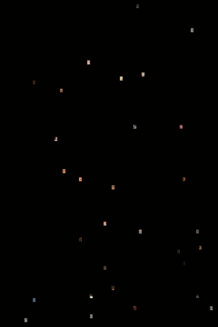
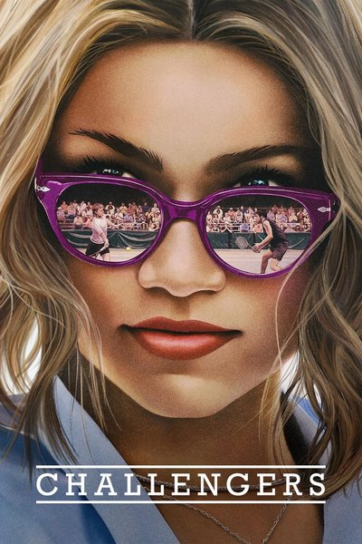
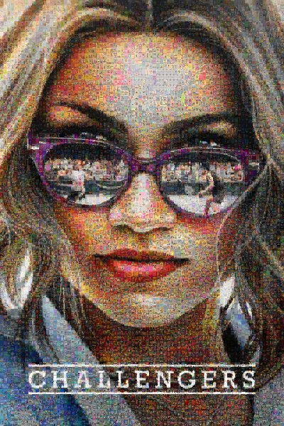
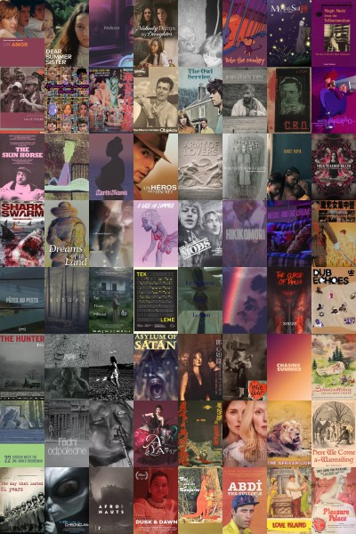

# Mosaic Posters

Generate photomosaics from any library of images. Given a reference image, the tool finds the best-matching tile for each cell in a grid, producing a high-resolution mosaic.

<p align="center">
  
</p>

<p align="center">
  
  &nbsp;&nbsp;&nbsp;
  
  &nbsp;&nbsp;&nbsp;
  
</p>
<p align="center">
  <em>Reference &rarr; 80x80 mosaic (6,400 unique posters) &rarr; zoomed detail</em>
</p>

## Quick start

```bash
pip install -r requirements.txt

# 1. Precompute color vectors for your tile images (only needed once)
python scripts/precompute.py --images path/to/tiles

# 2. Build a mosaic
python scripts/mosaic.py --reference photo.jpg --images path/to/tiles --cells 50
```

## How it works

Each tile image is divided into a 10x15 grid of cells. The average sRGB color of each cell produces a 450-dimensional feature vector. The reference image is center-cropped to match the tile aspect ratio and divided into a grid, where each cell is matched to the nearest unused tile by Euclidean distance.

Unlike simple mosaic tools that match on a single average color per tile, the 450D grid vector captures color *distribution* across the image, producing significantly better visual results.

### 1. Precompute tile vectors

```
python scripts/precompute.py --images path/to/tiles
```

| Flag | Default | Description |
|------|---------|-------------|
| `--images` | `$MOSAIC_IMAGES_DIR` or `images/` | Directory of tile images |
| `--output` | `data/grid_data.npz` | Output file path |
| `--tile-size` | `230x345` | Expected tile dimensions as WxH |
| `--metadata` | *(none)* | JSON metadata file for filtering |
| `--min-ratings` | `0` | Minimum rating count filter (requires `--metadata`) |
| `--genre` | *(none)* | Genre filter (requires `--metadata`) |

### 2. Build a mosaic

```
python scripts/mosaic.py --reference photo.jpg --images path/to/tiles --cells 80
```

| Flag | Default | Description |
|------|---------|-------------|
| `--reference` | *(required)* | Path to the reference image |
| `--data` | `data/grid_data.npz` | Precomputed vectors from step 1 |
| `--images` | `$MOSAIC_IMAGES_DIR` or `images/` | Directory of tile images |
| `--cells` | `30` | Number of columns in the mosaic grid |
| `--rows` | auto (from tile aspect ratio) | Number of rows |
| `--tile-size` | *(from npz)* | Override tile dimensions as WxH |
| `--output` | `output/mosaic.jpg` | Output file path |

## Using your own images

The mosaic works with any set of uniformly-sized images (JPEG or PNG), not just movie posters. To use your own:

1. **Prepare your tiles.** All images must be the same dimensions. The width must be divisible by 10 and the height by 15 (e.g., 230x345, 300x300, 200x300). Resize or crop your images to a uniform size before importing.

2. **Place them in a flat directory.** Put all images in a single folder — no subdirectories.

3. **Run the pipeline:**
   ```bash
   # For square 300x300 album art:
   python scripts/precompute.py --images my_album_art/ --tile-size 300x300

   # Build mosaic (aspect ratio is inferred from tile size)
   python scripts/mosaic.py --reference photo.jpg --images my_album_art/ --cells 40
   ```

The number of unique tiles limits your grid size — an 80x80 grid needs 6,400 images. If your library is smaller, use fewer `--cells`.

## Additional tools

| Script | Purpose |
|--------|---------|
| `scripts/fetch_new_posters.py` | Download poster images from Letterboxd or TMDB |
| `scripts/build_metadata.py` | Build/backfill a metadata JSON from Letterboxd |
| `scripts/deduplicate_posters.py` | Find and filter duplicate images by perceptual hash |

## Performance

Benchmarked on a 16-core machine:

| Step | 31K tiles | 120K tiles |
|------|-----------|------------|
| Precompute vectors | ~17s | ~65s |
| Build 80x80 mosaic | ~18s | ~25s |

Key optimizations:
- **BLAS matrix multiplication** for distance computation instead of KD-tree (faster in 450D)
- **Batched distance matrix** to avoid OOM with large tile libraries (120K+)
- **Threaded I/O** for image loading via OpenCV (releases the GIL)
- **Partial sort** (`argpartition`) to rank only the top-1000 candidates per cell
- **BGR passthrough** in assembly to avoid color-swapping the full mosaic array

## Setup

```
pip install -r requirements.txt
```

Requires Python 3.10+.
